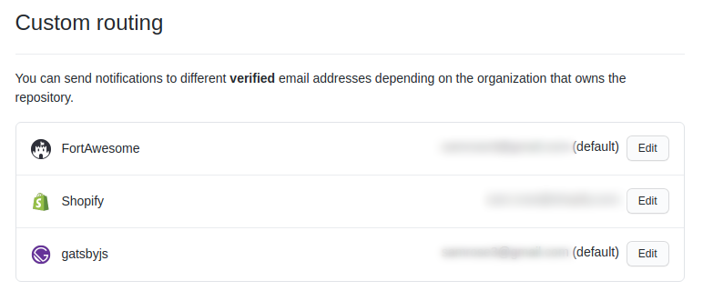

I recently went through the process of setting up a new machine: installing apps, customizing dotfiles, and [configuring git](https://git-scm.com/docs/git-config). One little nifty trick I want to highlight today is using _conditional includes_ for your global git options.

## But why?

This technique could be used for various git setting, but I've primarily used it for conditionally setting the git identity.

At work, we have the choice of using a dedicated or single GitHub account when working on code. When jumping between repos, I want an easy way to maintain proper commit author info by ensuring my personal and work emails where being used for the corresponding repositories.

## Setting a global user and email

Git associate your identity with every commit you make. You can set or change your git identity using the `git config` command or by saving the values in the global configuration file, `~/.gitconfig`.

```
# ~/.gitconfig

[user]
  name = Your Name
  email = personal@website.com
```

## Conditional extending the git configuration

The global git configuration can be extended based on the location of the repository on your file system. We can have a global configuration for all our default and then a specify overrides for all repos in a directory.

If we have all work related repos in the `~/work/` folder, we could apply our git identity overrides by adding a `~/work/.gitconfig` and then conditionally including this in our main global config:

```
# ~/.gitconfig

[user]
  name = Your Name
  email = personal@website.com

[includeIf "gitdir:~/work/"]
  path = ~/work/.gitconfig
```

```
# ~/work/.gitconfig

[user]
  name = Your Name
  email = work@website.com
```

**Pro tip** if you are using GitHub, checkout the [Settings > Notifications](https://github.com/settings/notifications) page. Under the "Custom routing" section, you can configure notifications to different [verified](https://github.com/settings/emails) email addresses based on the organization.



## Further reading

This is just one use-case for using the conditional includes feature in git. You can learn the details and see more examples in the git documentation [here](https://git-scm.com/docs/git-config#_conditional_includes).
