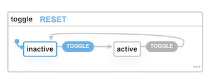

import BlogCard from '@components/BlogCard';

export {default} from '@components/BlogPost';

Over the last couple of years, we've started pushing our application state management to the browser. Managing state can be a large part of what makes our job as UI developers challenging. We've made great strides with patterns such as [Redux] and the [useReducer] hook in React.

I like Redux and `useReducer` and have found them a very effective method for handling state management. However, there are many benefits to using [finite state machines] and [statecharts] as a UI state management solution. The main advantage - you can _declaratively_ define the UI logic behind each state and restrict your states (no unknown or unintended states).

<BlogCard>
  <strong>Note:</strong> This is not intended to be an introduction to reducers
  or state machines, rather a light comparison between the two used in the
  context of React. If you are new to either concept, here are a few resources
  to dive into first
</BlogCard>

- React [useReducer] hook
- Xstate [concepts]
- [@xstate/fsm]
- [@xstate/react]

## Using a reducer

Here is a simple toggle button example showcasing the reducer pattern with the `useReducer` hook:

```jsx
import React, { useReducer } from 'react';

const reducer = (state, action) => {
  switch (action.type) {
    case 'TOGGLE':
      return state === 'active' ? 'inactive' : 'active';
    default:
      return state;
  }
};

const Toggler = () => {
  const [state, dispatch] = useReducer(reducer, 'inactive');

  return (
    <button onClick={() => dispatch({ type: 'TOGGLE' })}>
      {state === 'inactive' ? 'Activate' : 'Deactivate'}
    </button>
  );
};

export default Toggler;
```

A quick breakdown, the `useReducer` hook accepts two arguments: our reducer function and the initial state. The job of the reducer function is to return the new state when our `dispatch` function is called. The new state will depend on the `action` object that is dispatched.

In this example, there is only one action type that our reducer will respond (update) to, `TOGGLE`. When `dispatch` is executed with our action object of `{ type: 'TOGGLE' }`, the reducer contains the conditional logic that will flip our state value between `'active'` and `'inactive'`.

It works, but the switch statement and internal conditionals make it very procedural. To me, this seems manual and prone to leaving edge-cases unhandled.

## A simple FSM alternative

Let's migrate our reducer pattern over to using a finite state machine. The `@xstate/react` package is a wonderful way to start integrating the full power of XState into your React application. However, if your state management needs are simple (such as our basic reducer), the `@xstate/fsm` might be a sufficient start. This package is XState's minimal solution for creating finite state machines – a _1kb_ implementation of XState.

Instead of including all of XState plus the React package helpers, we can use the much smaller `@xstate/fsm` with our own `useMachine` hook.

Using a React hook makes it easier to use state machines with function components. As suggested in the [Usage with React] section of the XState docs, there are other hook-based solutions you can use or you can implement your own simple hook to interpret and use XState machines:

```js
import { useState, useMemo, useEffect } from 'react';
import { interpret } from '@xstate/fsm';

export function useMachine(machine) {
  // Keep track of the current machine state
  const [current, setCurrent] = useState(machine.initialState);

  // Interpret the machine and start the service (only once!)
  const service = useMemo(() => interpret(machine).start(), [machine]);

  useEffect(() => {
    // Subscribe to state changes
    service.subscribe((state) => {
      // Update the current machine state when
      // a transition occurs
      if (state.changed) {
        setCurrent(state);
      }
    });

    // Stop the service when the component unmounts
    return () => service.stop();
  }, [service]);

  return [current, service.send];
}
```

Let's break it down a bit:

1. Our machine's current state value is kept with the `useState` hook.
2. The provided machine configuration is [interpreted](https://xstate.js.org/docs/packages/xstate-fsm/#api) and then [started](https://xstate.js.org/docs/packages/xstate-fsm/#api).
3. A service, created from `interpret(machine)`, can be [subscribed](https://xstate.js.org/docs/packages/xstate-fsm/#api) to via the `.subscribe(...)` method.
4. Our subscription is notified of all state changes, updating our hook state when a transition occurs.
5. Our hook returns an array containing the current state and our service's [send] method so we can send transitions to our machine.

## Using our minimal machine hook

Now that we have our custom `useMachine` hook, let's put it into use in our Toggler component!

```jsx
import React from 'react';
import { createMachine } from '@xstate/fsm';
import { useMachine } from '../hooks/useMachine';

const toggleMachine = createMachine({
  id: 'toggle',
  initial: 'inactive',
  states: {
    inactive: { on: { TOGGLE: 'active' } },
    active: { on: { TOGGLE: 'inactive' } },
  },
});

const Toggler = () => {
  const [state, send] = useMachine(toggleMachine);

  return (
    <button onClick={() => send('TOGGLE')}>
      {state.value === 'inactive' ? 'Activate' : 'Deactivate'}
    </button>
  );
};

export default Toggler;
```

With a single, simple hook and the tiny `@xstate/fsm` library, we have migrated our reducer pattern to now using a state machine. We have replaced the reducer switch statement of uncertainty with a finite set of states and well-defined transitions.

## Visualizing our state machine

XState also has a visualizer that allows you to load and preview your state machine configuration. The visualizer can create a [sharable link](https://xstate.js.org/viz/?gist=8920aced5b898be4f270e82171434d96) of our toggle machine.



Instead of using a framework-specific API such as `useReducer`, our machine state logic is completely portable and can be used independently of React in any framework.

## Upgrade ready

This is only a small step towards replacing reducer logic with a more declarative machine-based pattern. If you want to use _all_ the statechart features such as nested states, parallel states, history states, activities, invoked services, delayed transitions, and transient transitions, we'll need to level up to the full XState library.

First, let's update our packages:

```sh
npm rm @xstate/fsm
npm install -S xstate @xstate/react
```

Now, we can update our Toggler component code:

1. Replace `@xstate/fsm` with `xstate`
2. Replace the `createMachine` function with the `Machine` factory function from `xstate`
3. Use the `@xstate/react` hook instead of our custom `useMachine` hook

```jsx
import React from 'react';
import { Machine } from 'xstate';
import { useMachine } from '@xstate/react';

const toggleMachine = Machine({
  id: 'toggle',
  initial: 'inactive',
  states: {
    inactive: { on: { TOGGLE: 'active' } },
    active: { on: { TOGGLE: 'inactive' } },
  },
});

const Toggler = () => {
  const [state, send] = useMachine(toggleMachine);

  return (
    <button onClick={() => send('TOGGLE')}>
      {state.value === 'inactive' ? 'Activate' : 'Deactivate'}
    </button>
  );
};

export default Toggler;
```

That's it! Now we have all the more advanced capabilities of XState without having to make a single change to our state logic.

Here is an example [CodeSandbox] comparing the `useReducer` method versus the `useMachine` hook with `@xstate/fsm`.

<iframe
  src="https://codesandbox.io/embed/xstate-fsm-vs-react-comparison-mw2ty?fontsize=14&hidenavigation=1&theme=dark"
  style={{ width: "100%", height: "500px", border: 0, borderRadius: "4px", overflow: "hidden" }}
  title="xstate-fsm-vs-react-comparison"
  allow="accelerometer; ambient-light-sensor; camera; encrypted-media; geolocation; gyroscope; hid; microphone; midi; payment; usb; vr; xr-spatial-tracking"
  sandbox="allow-forms allow-modals allow-popups allow-presentation allow-same-origin allow-scripts"
></iframe>

[redux]: http://redux.js.org/
[usereducer]: https://reactjs.org/docs/hooks-reference.html#usereducer
[finite state machines]: https://en.wikipedia.org/wiki/Finite-state_machine
[statecharts]: https://www.sciencedirect.com/science/article/pii/0167642387900359/pdf
[concepts]: https://xstate.js.org/docs/about/concepts.html
[@xstate/fsm]: https://xstate.js.org/docs/packages/xstate-fsm/
[@xstate/react]: https://xstate.js.org/docs/packages/xstate-react/
[usage with react]: https://xstate.js.org/docs/recipes/react.html#hooks
[codesandbox]: https://codesandbox.io/s/xstate-fsm-vs-react-comparison-mw2ty
