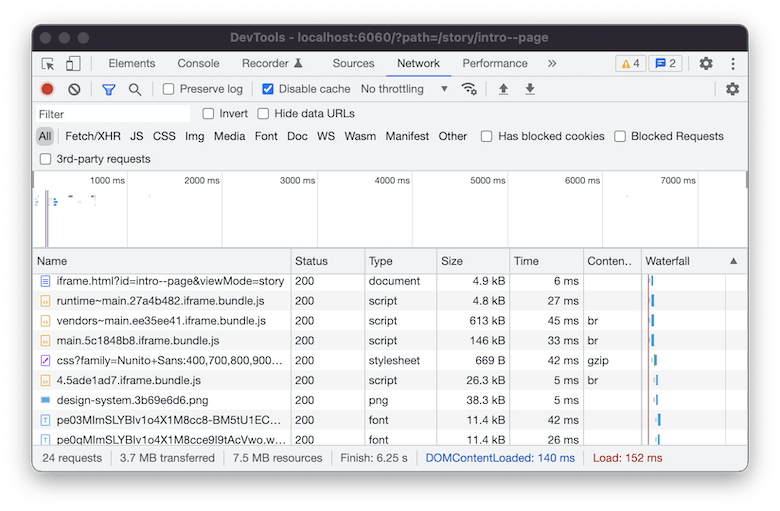

import BlogCard from '@components/BlogCard';

Storybook recently introduced an on-demand architecture for 3x smaller builds and faster load times in the [6.4 release](https://storybook.js.org/blog/storybook-6-4/). I won't dive into the [data or details](https://storybook.js.org/blog/storybook-on-demand-architecture/). At a high-level, this performance improvement is achieved by loading each story independently rather than packing them into a single monolithic bundle.

Now that our stories can be independently bundled and lazy-loaded, I was curious if we could take one more step in optimizing our static story assets. <span role="" aria-label="thinking and curious">🤔</span>

My friend, [Dustin Younse](https://twitter.com/milsyobtaf), recommended I look into [brotli](https://github.com/google/brotli), a generic-purpose lossless compression algorithm developed by Google, as a possible solution for further file shrinking.

Dustin and his team have found that using brotli compression for their design system Storybook has significantly helped improve load speeds for teams in Tokyo and Singapore (APAC). This may not be an issue if using a low-latency CDN for your teams Storybook. However, it is an easy integration and might be worth experimenting! <span role="img" aria-label="test tube">🧪</span>

<BlogCard>
  A quick note on compatibility. Not all static servers support delivering
  brotli compressed files. At the time of writing this, GitHub Pages
  automatically compresses and serves assets using gzip. There are other static
  page hosting services that will prefer and use brotli compressed versions.
  Check your static service provider's compression compatibility or to enable
  serving brotli if you are using your own server.
</BlogCard>

## Adding Brotli

Adding brotli compression to our Storybook configuration is made more convenient thanks to the to the [brotli-webpack-plugin](https://www.npmjs.com/package/brotli-webpack-plugin). First, install the plugin package as a dev dependency.

```
npm install --save-dev brotli-webpack-plugin
```

Then, add the plugin to the `main.js` webpack config for Storybook.

```js
const BrotliPlugin = require('brotli-webpack-plugin');

module.exports = {
  // Add the brotli plugin to your final webpack configuration
  webpackFinal: async (config, { configType }) => {
    if (configType === 'PRODUCTION') {
      config.plugins.push(
        new BrotliPlugin({
          asset: '[path].br[query]',
          test: /\.(js|css|html|svg)$/,
          threshold: 10240,
          minRatio: 0.8,
        })
      );
    }
    return config;
  },
};
```

Build a production-ready version of the Storybook which is setup by Storybook as the following script:

```
npm run build-storybook
```

The output will include `*.(js|css|html|svg)` files as usual. With the plugin installed, it should now also generate `*.(js|css|html|svg).br` assets which will be preferred and served by brotli compatible static servers.

One way we can test the Storybook output is by using [`http-server`](https://github.com/http-party/http-server) static HTTP server with the `-b` or `--brotli` flag enabled. Preview it locally by running the following command:

```
npx http-server -b ./path/to/build
```

The Chrome DevTools [Network tab](https://developer.chrome.com/docs/devtools/network/) can be used to verify that the brotli encoded version is being properly delivered.


